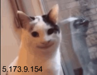

# Image IP grabber

A simple nodejs server that responds with an image displaying a funny cat and the client's ip.

Example result:

To run the server use: `node server.js`

It will run it as an http server on port `8080`.

Visit `http://localhost:8080/` to see the results, although on localhost they may just be disappointing.
To make them more fun (and usable by others) forward it to wan with a service like `ngrok` or `localhost.run`!

Have fun. :D
